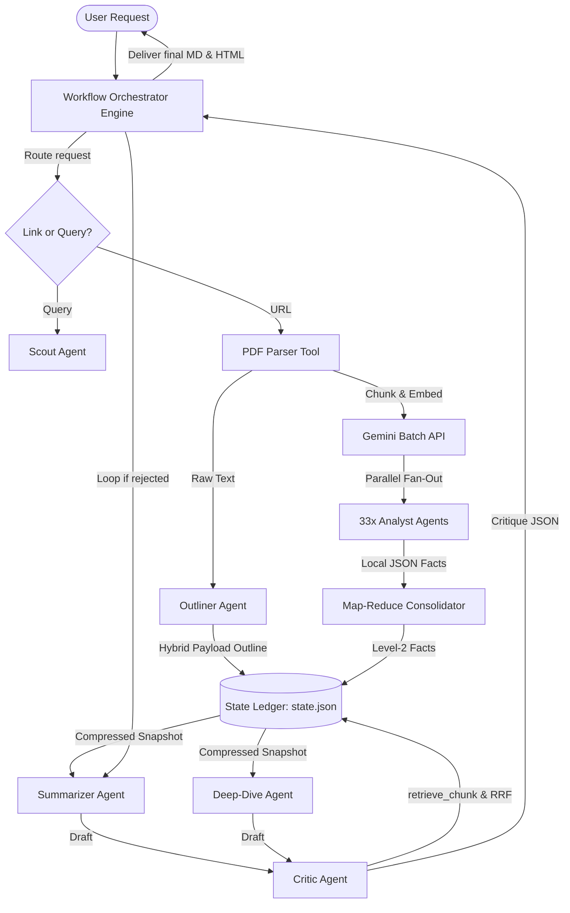

# Hypatia: Multi-Agent Scientific Literature Assistant

> **Disclaimer**: This is a personal project. The views, code, and opinions expressed are my own and do not represent those of my current or past employers.

---

Hypatia is a Python-based multi-agent application designed to search, parse, summarize, and explain academic literature. Powered by the **Google Antigravity SDK** and Gemini models, Hypatia converts research PDFs or search queries into text summaries and technical deep dives.

---

## 1. System Architecture

Hypatia is structured around a **Coordinator-Specialist (Orchestrator-Workers)** multi-agent topology. Rather than relying on a single prompt to parse, write, and verify, Hypatia coordinates a team of **6 specialized worker agents** and dedicated processing tools, using a Python-based asynchronous workflow engine to verify factual consistency and readability.



### System Components

#### Orchestration & Parsing Tools
1.  **Workflow Orchestrator Engine (Python Code)**: The central asynchronous coordinator (`workflow.py`). It manages execution states, runs independent agents in parallel streams using `asyncio.gather`, and implements the critique-and-revision feedback loops.
2.  **PDF Parser Tool**: A python module (`tools/parser.py`) that downloads research PDFs and extracts raw page text cleanly using PyMuPDF.

#### The Specialized Worker Agents
1.  **Searcher (Scout Agent)**: Uses the arXiv API to translate natural language queries into academic paper candidate links.
2.  **Outliner (Explainer Agent)**: Runs immediately after parsing to extract a high-level Document Outline (Hybrid Payload).
3.  **Analyst (Analyst Agent)**: Fanned out concurrently across all text chunks to extract atomic facts and preserve deep mathematical equations.
4.  **Consolidator**: A Map-Reduce step that deduplicates the Analysts' findings into a highly dense Level 2 Snapshot.
5.  **Summarizer (Summarizer Agent)**: Synthesizes the snapshot into an accessible, readable summary for general software engineers (Artifact 1).
6.  **Deep-Dive Writer (Deep-Dive Agent)**: Drafts an uncompromising, production-grade architectural blueprint for senior systems engineers (Artifact 2).
7.  **Critic (Peer Reviewer)**: Fact-checks drafts using a deterministic `retrieve_chunk` tool and hybrid RRF search. Rejects drafts containing factual inconsistencies or hallucinations.

---

## 2. Local Setup & Installation

Follow these steps to configure your local Python environment and run Hypatia.

### Prerequisites
*   **Python:** Version 3.10 or higher.
*   **Gemini API Key:** Required to connect to Gemini models. Obtain a key from [Google AI Studio](https://aistudio.google.com/app/api-keys).

### Installation
We recommend using **`uv`**, a Python package manager, to manage your virtual environment:

1.  Clone the repository and navigate to the project root:
    ```bash
    cd hypatia
    ```
2.  Create a virtual environment:
    ```bash
    uv venv
    ```
3.  Install the dependencies:
    ```bash
    uv pip install -r requirements.txt
    ```

### Environment Setup
Create a `.env` file in the root directory and add your Gemini API Key:
```env
GEMINI_API_KEY="your-gemini-api-key"
```

---

## 3. Running Hypatia

Hypatia provides two execution modes depending on your API key type and rate-limit allocations:

### Running the Pipeline
Because Hypatia utilizes a State-Externalizing Harness with RAPTOR chunking, the execution is inherently token-saving and heavily parallelized. 

Simply run the main script to trigger the full multi-agent workflow:
```bash
.venv/bin/python main.py
```

### Option C: Custom Model Selection
By default, Hypatia uses `gemini-3.5-flash`. You can specify a different model directly using the `--model` flag.

For example, to run with `gemini-3.5-pro` in lite mode:
```bash
.venv/bin/python main.py --lite --model gemini-3.5-pro
```

To run with `gemma-4-26b-a4b-it` (which should use `--lite` mode due to smaller context limits) with debug logging enabled:
```bash
.venv/bin/python main.py --lite --model gemma-4-26b-a4b-it --debug
```

### Option D: Real-time Debug Mode
To stream the internal reasoning steps (thoughts) of all agents in real-time to the console, append the `--debug` flag:
```bash
.venv/bin/python main.py --debug
.venv/bin/python main.py --lite --debug
```

### Example Inputs

When prompted by the CLI, you can load a paper using either a query or a direct URL:

*   **Option 1: Search Query**
    *   `Explain the most influential paper in database in last one month duration.`
*   **Option 2: Direct URL**
    *   `https://arxiv.org/pdf/1901.01930` (direct PDF link)

---

## 4. System Outputs

Once execution completes, Hypatia compiles both markdown drafts and styled HTML documents into the `output/` directory:

```text
output/<paper_name>/
├── raw_text.txt       # Clean parsed raw text of the paper PDF
├── summary.md         # High-level summary (Artifact 1)
├── summary.html       # Interactively styled HTML summary with dark/light theme
├── deep_dive.md       # In-depth technical guide (Artifact 2)
└── deep_dive.html     # Interactively styled HTML deep-dive with dark/light theme and live Mermaid rendering
```

The HTML files are rendered using a responsive CSS design system with standard typography, custom code block formatting, and live Mermaid.js diagram drawing.