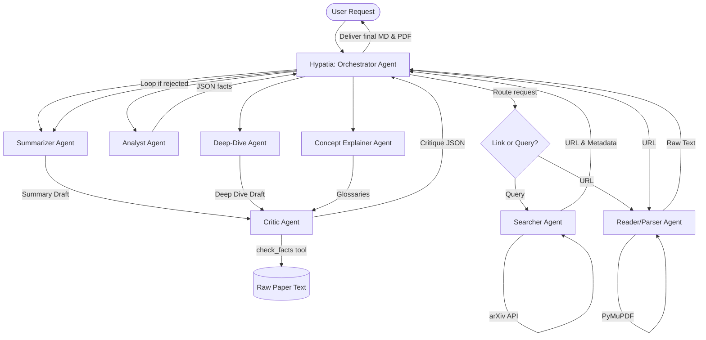

# Hypatia: Multi-Agent Scientific Literature Assistant

Hypatia is a Python-based multi-agent application designed to search, parse, summarize, and explain academic literature. Powered by the **Google Antigravity SDK** and Gemini models, Hypatia converts research PDFs or search queries into text summaries and technical deep dives.

---

## 1. System Architecture

Hypatia is structured around a **Coordinator-Specialist (Orchestrator-Workers)** multi-agent topology. Rather than relying on a single prompt to parse, write, and verify, Hypatia orchestrates a team of 8 agents to verify factual consistency and readability.



### The 8 Specialized Agents
1.  **Hypatia (Orchestrator):** The supervisor agent. Coordinates inputs, manages state variables, spawns specialized agents, and compiles output artifacts.
2.  **Searcher:** Uses the arXiv API to translate natural language queries (e.g., topics or dates) into academic papers, providing metadata and PDF links.
3.  **Reader/Parser:** Downloads the PDF and extracts raw page text cleanly using PyMuPDF.
4.  **Analyst:** Operates on the extracted paper text to mine core structural facts (novelty, baselines, key metrics, methodology steps) into structured JSON.
5.  **Concept Explainer:** Extracts technical terms and generates explanations with real-world analogies.
6.  **Summarizer:** Drafts a summary (Artifact 1) outlining the paper's key goals, methodology, and findings.
7.  **Deep-Dive Writer:** Drafts a technical document (Artifact 2) explaining equations, architectures, and experimental configurations.
8.  **Critic (Peer Reviewer):** Fact-checks drafts against the original paper text using local RAG keyword searches. Rejects drafts containing factual inconsistencies or errors, passing detailed correction feedback to the writing agents.

---

## 2. Local Setup & Installation

Follow these steps to configure your local Python environment and run Hypatia.

### Prerequisites
*   **Python:** Version 3.10 or higher.
*   **Gemini API Key:** Required to connect to Gemini models. Obtain a key from [Google AI Studio](https://aistudio.google.com/app/api-keys).

### Installation
We recommend using **`uv`**, a Python package manager, to manage your virtual environment:

1.  Clone the repository and navigate to the project root:
    ```bash
    cd hypatia
    ```
2.  Create a virtual environment:
    ```bash
    uv venv
    ```
3.  Install the dependencies:
    ```bash
    uv pip install -r requirements.txt
    ```

### Environment Setup
Create a `.env` file in the root directory and add your Gemini API Key:
```env
GEMINI_API_KEY="your-gemini-api-key"
```

---

## 3. Running Hypatia

Hypatia provides two execution modes depending on your API key type and rate-limit allocations:

### Mode A: Full Context Mode (Default)
By default, Hypatia runs in **Full Context Mode**. It processes the full text of the research paper in every agent prompt. This requires a standard Gemini API key with sufficient rate limits.
```bash
.venv/bin/python main.py
```

### Mode B: Lite Mode (Token-Saving)
If you are running on a restricted **Gemini Free Tier** key, pass the `--lite` flag. This limits context length to 40,000 characters and switches the Critic agent to RAG mode to reduce input tokens. It also introduces a 12-second sleep cooldown between agent calls to respect rate limits.
```bash
.venv/bin/python main.py --lite
```

### Option C: Custom Model Selection
By default, Hypatia uses `gemini-3.5-flash`. You can specify a different model directly using the `--model` flag.

For example, to run with `gemini-3.5-pro` in lite mode:
```bash
.venv/bin/python main.py --lite --model gemini-3.5-pro
```

To run with `gemma-4-26b-a4b-it` (which should use `--lite` mode due to smaller context limits) with debug logging enabled:
```bash
.venv/bin/python main.py --lite --model gemma-4-26b-a4b-it --debug
```

### Option D: Real-time Debug Mode
To stream the internal reasoning steps (thoughts) of all agents in real-time to the console, append the `--debug` flag:
```bash
.venv/bin/python main.py --debug
.venv/bin/python main.py --lite --debug
```

---

## 4. System Outputs

Once execution completes, Hypatia compiles both markdown drafts and styled PDF documents into the `output/` directory:

```text
output/<paper_name>/
├── raw_text.txt       # Clean parsed raw text of the paper PDF
├── summary.md         # High-level summary (Artifact 1)
├── summary.pdf        # Print-ready styled PDF of the summary
├── deep_dive.md       # In-depth technical guide (Artifact 2)
└── deep_dive.pdf      # Print-ready styled PDF of the deep-dive
```

The PDF files are rendered using HTML-to-PDF converters with custom styling, standard margins, and typography.